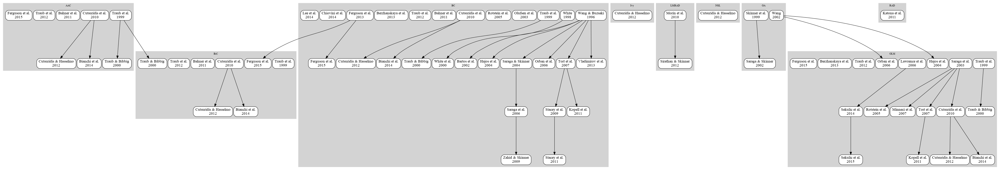
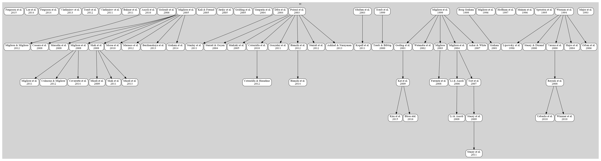

## Collaborative and Integrative Modeling of Hippocampal Area CA1

### Introduction

This initiative resulted from a [Human Brain Project](http://humanbrainproject.eu/) sponsored meeting in London on 31st March & 1st April 2015: [HBP Hippocamp CA1: Collaborative and Integrative Modeling of Hippocampal Area CA1](http://neuralensemble.org/meetings/HippocampCA1)

### Overview of published CA1 cell and network models

#### Interneuron models

[List of interneuron models](https://github.com/OpenSourceBrain/CommunityModellingCA1/blob/master/CA1_interneurons.md) with references and ModelDB IDs (if existing)

-----------------------------------------------------------------------------

#### Pyramidal cell models

[List of pyramidal cell models](https://github.com/OpenSourceBrain/CommunityModellingCA1/blob/master/CA1_pyradmidalCells.md) with references and ModelDB IDs (if existing)

-----------------------------------------------------------------------------

#### CSV file of all models

[CA1model.csv](https://github.com/OpenSourceBrain/CommunityModellingCA1/blob/master/CA1Models.csv) contains a database of all known published CA1 cell models. 

**Is there a model missing?? Please [open an issue](https://github.com/OpenSourceBrain/CommunityModellingCA1/issues/new) and let us know!**

We have created a script ([Parse.py](https://github.com/OpenSourceBrain/CommunityModellingCA1/blob/master/Parse.py)) which will eventually be able to generate the above 
figures automatically. See [issue #4](https://github.com/OpenSourceBrain/CommunityModellingCA1/issues/4) for progress with this.

For now, the figures produced are:

*Interneurons:*

*Pyramidal cell models:*

